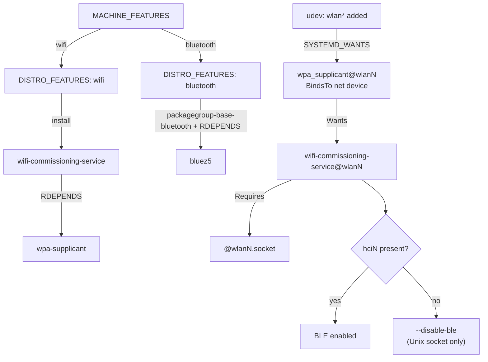

# Wifi Commissioning

`omnect-os` can commission Wi-Fi (join a network) over a BLE GATT interface and
a local Unix-socket API, provided by `wifi-commissioning-service`. This page
explains what gets **installed** versus what actually **runs**, and why that
differs between fixed-hardware (ARM) and generic-hardware (x86) devices.

## The one rule

- **Installed** = the package is in the image. Governed by `DISTRO_FEATURES`
  (derived from `MACHINE_FEATURES`).
- **Runs** = the service is active and BLE is on. Governed by the **physical
  adapter** present on that specific unit at runtime.

On **fixed hardware** the two coincide (the machine knows its adapters). On
**generic hardware** (x86) the same image ships everywhere, so they diverge per
unit.

## What gets installed (build time)

| `MACHINE_FEATURES` → `DISTRO_FEATURES` | pulls in |
| --- | --- |
| `wifi` | `wifi-commissioning-service` (via `omnect-os-image.bb`), which `RDEPENDS` `wpa-supplicant` |
| `bluetooth` | `bluez5` — via OE `packagegroup-base-bluetooth` (`COMBINED_FEATURES`) and `wifi-commissioning-service`'s `RDEPENDS` |

`wifi` is the single gate for commissioning; there is no separate
`wifi-commissioning` feature.

## What runs, and when (runtime)

Start is gated on the wlan adapter appearing — the same mechanism on every
platform:

1. A udev rule (`80-wlan-wpa.rules`) fires when a `wlan*` interface appears and
   pulls in `wpa_supplicant@<dev>.service`.
2. `wpa_supplicant@.service` is `BindsTo` the network device, so it starts when
   the adapter appears (including a hot-plugged USB dongle) and stops when it is
   removed. There is **no** static `*.target.wants` enablement.
3. `wpa_supplicant` `Wants` `wifi-commissioning-service@<dev>.service`, which
   `Requires` its `@<dev>.socket`. So commissioning rides along with
   `wpa_supplicant`.

A device with no wlan adapter starts nothing until one appears.

## Bluetooth / BLE

`wifi-commissioning-service` serves both a BLE GATT interface and a Unix-socket
API. The `--disable-ble` flag is decided as late as possible:

- **No `bluetooth` feature in the build:** there is no BlueZ, so `--disable-ble`
  is forced at build time and the `bluetooth.service` dependency is stripped.
- **Otherwise:** decided at runtime — the service is launched with
  `--disable-ble` only when no BT controller is present
  (`/sys/class/bluetooth/hci*`), so a hot-plugged BT dongle is respected.
- Either way the service is resilient: if BLE fails to start it logs one error
  and keeps serving the Unix-socket API.

Operators can override the flag via `WIFI_COMMISSIONING_EXTRA_ARGS` in
`/etc/omnect/wifi-commissioning-service.env`.

## Per device class

| Class | Example | `wifi` / `bluetooth` | Installed | Runs |
| --- | --- | --- | --- | --- |
| Fixed HW, wifi+BT | Raspberry Pi 4 | yes / yes | yes | always (onboard wifi+BT) |
| Fixed HW, neither | Phygate Tauri-L | no / no | no | — |
| Generic HW (x86) | Welotec Arrakis | yes / yes | yes | per unit — Arrakis **Mk4** (wifi+BT) yes, **Pico** (no adapters) no |

## Flow

## Where to change what

| Concern | File |
| --- | --- |
| Install gate (`wifi`) | `recipes-omnect/images/omnect-os-image.bb` |
| Runtime start gate | `recipes-connectivity/wpa-supplicant/wpa-supplicant/wpa_supplicant@.service` + `.../80-wlan-wpa.rules` |
| BLE decision | `recipes-omnect/wifi-commissioning-service/wifi-commissioning-service.inc` + `.../files/10-omnect-runtime.conf` |
| bluez restart workaround (rpi) | `dynamic-layers/raspberrypi/recipes-connectivity/bluez5/bluez5_%.bbappend` |
