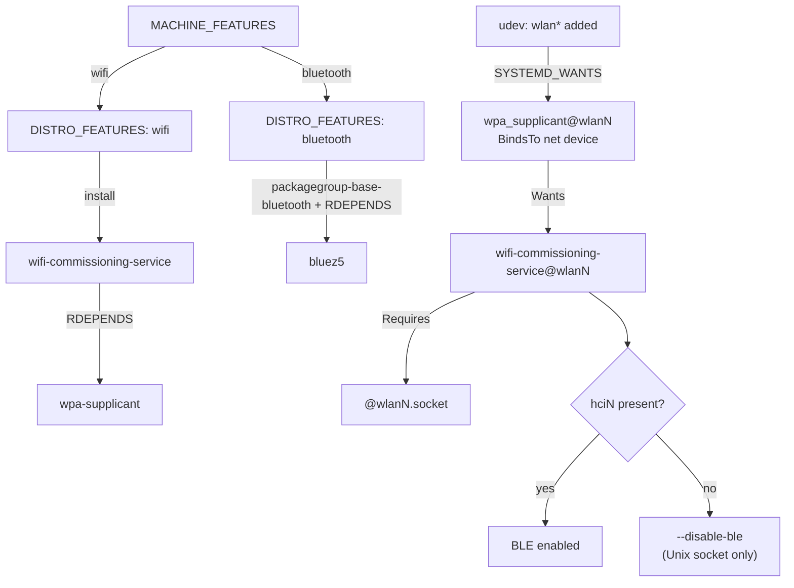

# Wifi Commissioning Documentation Implementation Plan

> **For agentic workers:** REQUIRED SUB-SKILL: Use superpowers:subagent-driven-development (recommended) or superpowers:executing-plans to implement this plan task-by-task. Steps use checkbox (`- [ ]`) syntax for tracking.

**Goal:** Document the install/run logic and dependencies of `bluez5`, `wpa_supplicant`, and `wifi-commissioning-service` — a concise maintainer reference plus per-device capability updates and cross-links.

**Architecture:** One device-independent topic doc (`doc/wifi_commissioning.md`) carrying the shared logic + a mermaid diagram; the three per-device docs keep a thin capability row linked to it (WELOTEC/Arrakis adapted for its two variants); a README Features link.

**Tech Stack:** Markdown, mermaid (GitHub-rendered), Yocto/BitBake recipe facts.

## Global Constraints

- **Documentation only** — no recipe or runtime behaviour changes.
- Every stated fact MUST match the recipes on the current `chore` branch (post PR #664): install gate = `wifi`; udev `80-wlan-wpa.rules` + `BindsTo` on `wpa_supplicant@.service`; `Wants=wifi-commissioning-service@%i.service`; runtime `--disable-ble` drop-in `10-omnect-runtime.conf`; build-time force when no `bluetooth`.
- Follow existing `doc/` conventions: topic file per feature; capability tables; feature names may be links (e.g. `[**Secure Boot**](efi_secure_boot.md)`).
- WELOTEC (Arrakis) variant values come from `omnect-os/ci/test_devices/dut16_arrakis-mk4.yaml` (wifi 1 / bt 1) and `dut8_arrakis-pico.yaml` (wifi 0 / bt 0).
- Links are repo-relative and must resolve.
- **Commit sign-off (required):** `Signed-off-by: Jan Zachmann 50990105+JanZachmann@users.noreply.github.com`
- Verification is doc-appropriate: grep the recipes to confirm claims, `test -f` link targets, and confirm the mermaid fence is well-formed. No unit tests.

---

## File structure

- **Create** `doc/wifi_commissioning.md` — the device-independent reference + mermaid diagram.
- **Modify** `doc/RASPBERRY-PI.md` — link the commissioning capability row (value stays `yes`).
- **Modify** `doc/PHYTEC.md` — link the row (value stays `no`).
- **Modify** `doc/WELOTEC.md` — link the row + adapt value for Mk4/Pico.
- **Modify** `README.md` — add a Features bullet linking the topic doc.

---

## Task 1: Create the topic doc `doc/wifi_commissioning.md`

**Files:**
- Create: `doc/wifi_commissioning.md`

**Interfaces:**
- Produces: `doc/wifi_commissioning.md`, the link target used by Task 2.

- [ ] **Step 1: Write the file**

Create `doc/wifi_commissioning.md` with exactly this content:

````markdown
# Wifi Commissioning

`omnect-os` can commission Wi-Fi (join a network) over a BLE GATT interface and
a local Unix-socket API, provided by `wifi-commissioning-service`. This page
explains what gets **installed** versus what actually **runs**, and why that
differs between fixed-hardware (ARM) and generic-hardware (x86) devices.

## The one rule

- **Installed** = the package is in the image. Governed by `DISTRO_FEATURES`
  (derived from `MACHINE_FEATURES`).
- **Runs** = the service is active and BLE is on. Governed by the **physical
  adapter** present on that specific unit at runtime.

On **fixed hardware** the two coincide (the machine knows its adapters). On
**generic hardware** (x86) the same image ships everywhere, so they diverge per
unit.

## What gets installed (build time)

| `MACHINE_FEATURES` → `DISTRO_FEATURES` | pulls in |
| --- | --- |
| `wifi` | `wifi-commissioning-service` (via `omnect-os-image.bb`), which `RDEPENDS` `wpa-supplicant` |
| `bluetooth` | `bluez5` — via OE `packagegroup-base-bluetooth` (`COMBINED_FEATURES`) and `wifi-commissioning-service`'s `RDEPENDS` |

`wifi` is the single gate for commissioning; there is no separate
`wifi-commissioning` feature.

## What runs, and when (runtime)

Start is gated on the wlan adapter appearing — the same mechanism on every
platform:

1. A udev rule (`80-wlan-wpa.rules`) fires when a `wlan*` interface appears and
   pulls in `wpa_supplicant@<dev>.service`.
2. `wpa_supplicant@.service` is `BindsTo` the network device, so it starts when
   the adapter appears (including a hot-plugged USB dongle) and stops when it is
   removed. There is **no** static `*.target.wants` enablement.
3. `wpa_supplicant` `Wants` `wifi-commissioning-service@<dev>.service`, which
   `Requires` its `@<dev>.socket`. So commissioning rides along with
   `wpa_supplicant`.

A device with no wlan adapter starts nothing until one appears.

## Bluetooth / BLE

`wifi-commissioning-service` serves both a BLE GATT interface and a Unix-socket
API. The `--disable-ble` flag is decided as late as possible:

- **No `bluetooth` feature in the build:** there is no BlueZ, so `--disable-ble`
  is forced at build time and the `bluetooth.service` dependency is stripped.
- **Otherwise:** decided at runtime — the service is launched with
  `--disable-ble` only when no BT controller is present
  (`/sys/class/bluetooth/hci*`), so a hot-plugged BT dongle is respected.
- Either way the service is resilient: if BLE fails to start it logs one error
  and keeps serving the Unix-socket API.

Operators can override the flag via `WIFI_COMMISSIONING_EXTRA_ARGS` in
`/etc/omnect/wifi-commissioning-service.env`.

## Per device class

| Class | Example | `wifi` / `bluetooth` | Installed | Runs |
| --- | --- | --- | --- | --- |
| Fixed HW, wifi+BT | Raspberry Pi 4 | yes / yes | yes | always (onboard wifi+BT) |
| Fixed HW, neither | Phygate Tauri-L | no / no | no | — |
| Generic HW (x86) | Welotec Arrakis | yes / yes | yes | per unit — Arrakis **Mk4** (wifi+BT) yes, **Pico** (no adapters) no |

## Flow



## Where to change what

| Concern | File |
| --- | --- |
| Install gate (`wifi`) | `recipes-omnect/images/omnect-os-image.bb` |
| Runtime start gate | `recipes-connectivity/wpa-supplicant/wpa-supplicant/wpa_supplicant@.service` + `.../80-wlan-wpa.rules` |
| BLE decision | `recipes-omnect/wifi-commissioning-service/wifi-commissioning-service.inc` + `.../files/10-omnect-runtime.conf` |
| bluez restart workaround (rpi) | `dynamic-layers/raspberrypi/recipes-connectivity/bluez5/bluez5_%.bbappend` |
````

- [ ] **Step 2: Verify the stated facts against the recipes**

Run each check; every one must confirm the doc's claim:
```bash
cd /home/jzac/projects/meta-omnect
grep -q "contains('DISTRO_FEATURES', 'wifi', ' wifi-commissioning-service'" recipes-omnect/images/omnect-os-image.bb && echo "OK install gate"
grep -q "wpa-supplicant" recipes-omnect/wifi-commissioning-service/wifi-commissioning-service.inc && echo "OK wpa RDEPENDS"
grep -q "bluez5" recipes-omnect/wifi-commissioning-service/wifi-commissioning-service.inc && echo "OK bluez RDEPENDS"
grep -q 'SYSTEMD_WANTS.*wpa_supplicant@%k' recipes-connectivity/wpa-supplicant/wpa-supplicant/80-wlan-wpa.rules && echo "OK udev rule"
grep -q "BindsTo=sys-subsystem-net-devices-%i.device" recipes-connectivity/wpa-supplicant/wpa-supplicant/wpa_supplicant@.service && echo "OK BindsTo"
grep -q "Wants=wifi-commissioning-service@%i.service" recipes-connectivity/wpa-supplicant/wpa-supplicant/wpa_supplicant@.service && echo "OK Wants"
grep -q "/sys/class/bluetooth/hci" recipes-omnect/wifi-commissioning-service/files/10-omnect-runtime.conf && echo "OK hci probe"
```
Expected: seven `OK ...` lines. If any is missing, fix the doc wording to match reality before continuing.

- [ ] **Step 3: Verify the mermaid fence is well-formed**

Run:
```bash
awk '/^```mermaid$/{c++} /^```$/{if(c==1){print "mermaid block closed"; c=2}}' doc/wifi_commissioning.md
grep -c '^```' doc/wifi_commissioning.md
```
Expected: prints `mermaid block closed`, and the backtick-fence count is even (all fences balanced). If `mmdc` (mermaid-cli) is installed, optionally `mmdc -i doc/wifi_commissioning.md -o /tmp/wc.svg` should succeed; otherwise a visual check on GitHub suffices.

- [ ] **Step 4: Commit**

```bash
git add doc/wifi_commissioning.md
git commit -s -m "docs(wifi): add wifi-commissioning install/run reference

Device-independent maintainer doc: feature->package install chains,
udev+BindsTo runtime start gate, runtime vs build-time --disable-ble,
the exists-vs-runs principle, a mermaid flow, and a where-to-change map."
```

---

## Task 2: Link the topic doc from the per-device docs and README

**Files:**
- Modify: `doc/RASPBERRY-PI.md:14`
- Modify: `doc/PHYTEC.md:23`
- Modify: `doc/WELOTEC.md` (the `Wifi Commissioning via Bluetooth` row)
- Modify: `README.md` (under `## Features`)

**Interfaces:**
- Consumes: `doc/wifi_commissioning.md` from Task 1 (link target).

- [ ] **Step 1: RASPBERRY-PI.md — link the row (value unchanged)**

Replace the line:
```
| **Wifi Commissioning via Bluetooth** | yes                  |
```
with:
```
| [**Wifi Commissioning via Bluetooth**](wifi_commissioning.md) | yes                  |
```

- [ ] **Step 2: PHYTEC.md — link the row (value unchanged)**

Replace the line:
```
| **Wifi Commissioning via Bluetooth** | no              |
```
with:
```
| [**Wifi Commissioning via Bluetooth**](wifi_commissioning.md) | no              |
```

- [ ] **Step 3: WELOTEC.md — link the row and adapt for the two variants**

Replace the line:
```
| **Wifi Commissioning via Bluetooth** | no                      |
```
with:
```
| [**Wifi Commissioning via Bluetooth**](wifi_commissioning.md) | Mk4: yes, Pico: no      |
```

- [ ] **Step 4: README.md — add a Features bullet**

In `README.md`, immediately after the AppArmor line:
```
    - [Mandatory Access Control (AppArmor)](doc/mac_lsm.md): the AppArmor Linux Security Module (LSM) is compiled in and its userspace is installed; DAC stays the default and AppArmor is boot-selectable.
```
add:
```
    - [Wifi commissioning](doc/wifi_commissioning.md): installed on wifi-capable images; the service is adapter-gated at runtime and decides BLE from real Bluetooth presence.
```

- [ ] **Step 5: Verify links resolve and WELOTEC values match the DUTs**

Run:
```bash
cd /home/jzac/projects/meta-omnect
test -f doc/wifi_commissioning.md && echo "OK target exists"
grep -c "(wifi_commissioning.md)" doc/RASPBERRY-PI.md doc/PHYTEC.md doc/WELOTEC.md README.md
grep -q "Mk4: yes, Pico: no" doc/WELOTEC.md && echo "OK welotec adapted"
# cross-check the DUT source values
grep -q 'test_dut_wifi: "1"' ../omnect-os/ci/test_devices/dut16_arrakis-mk4.yaml && grep -q 'test_dut_bt: "1"' ../omnect-os/ci/test_devices/dut16_arrakis-mk4.yaml && echo "OK mk4 = wifi+bt"
grep -q 'test_dut_wifi: "0"' ../omnect-os/ci/test_devices/dut8_arrakis-pico.yaml && grep -q 'test_dut_bt: "0"' ../omnect-os/ci/test_devices/dut8_arrakis-pico.yaml && echo "OK pico = neither"
```
Expected: `OK target exists`; each of the four files reports `1`; `OK welotec adapted`; `OK mk4 = wifi+bt`; `OK pico = neither`.

- [ ] **Step 6: Commit**

```bash
git add doc/RASPBERRY-PI.md doc/PHYTEC.md doc/WELOTEC.md README.md
git commit -s -m "docs(wifi): link wifi-commissioning doc; adapt Arrakis capability

Per-device capability rows now link the new reference. Welotec/Arrakis
reflects its variants (Mk4 wifi+BT vs Pico none). README Features entry added."
```

---

## Self-review

**Spec coverage:**
- Topic doc device-independent, concise: Task 1. ✓
- Install chains (wifi→svc→wpa; bluetooth→bluez): Task 1 Step 1 + verified Step 2. ✓
- Runtime udev+BindsTo+Wants cascade: Task 1. ✓
- BLE build-time force vs runtime probe + graceful degradation + operator override: Task 1. ✓
- exists-vs-runs principle + per-device-class table: Task 1. ✓
- Mermaid diagram: Task 1 Step 1, checked Step 3. ✓
- Per-device links; WELOTEC Mk4/Pico adaptation: Task 2. ✓
- README Features link: Task 2 Step 4. ✓
- Out of scope (secure-boot, binary internals, behaviour changes): respected — docs only. ✓

**Placeholder scan:** none — the full doc content and every exact before/after edit are inline; `<dev>`/`wlanN`/`hciN` are documentation placeholders shown to the reader, not plan gaps.

**Consistency:** link target filename `wifi_commissioning.md` is identical across Task 1 (created) and every Task 2 reference and both commit bodies; capability values (rpi4 yes, tauri no, Arrakis Mk4 yes/Pico no) match the spec and the DUT yaml files.
